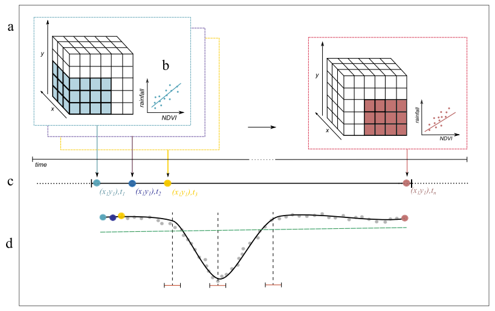
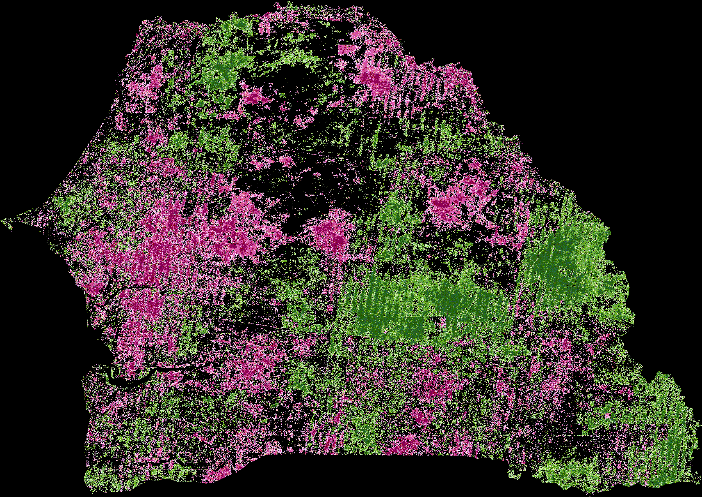

# Sequential Linear Regression Slopes (SeRGS) in Google Earth Engine


(Taken from [Abel et al., 2019](https://www.sciencedirect.com/science/article/abs/pii/S0034425719300653))

## Introduction
A GEE implementation of the Sequential Linear Regression Slopes (SeRGS).

Only the JS API has been developed. The Python API implementation will be coming shortly.

## Features
Sequential Linear regression slopes (SeRGS) combines the power of linear regressions with a spatio-temporal moving window.
Usually, a direct relationship between vegetation activity and climate dynamics is assumed, without considering lagged responses.
By sequentially calculating the slope within every temporal moving window, the temporal variability of the 
relationship between the independent (e.g. rainfall) and dependent (e.g. NDVI) variables can be monitored. 

In the specific case of the rainfall-vegetation relationship, the effect of inter-annual rainfall variability on vegetation is also
reduced, making the identification of change that stretches beyond short-term variability more feasible. 

The hypothesis of SeRGS, as per the creator of the algorithm 
([Abel et al., 2019](https://www.sciencedirect.com/science/article/abs/pii/S0034425719300653)), is that any significant trends detected using
SeRGS reflect biophysical processes, and as a result correspond to changes in ecosystem functioning.

## Usage
The details about parameter setting and their associated methods is described in the main script `sergs.js`.

To use the code, either copy-paste it to your code editor environment, or simply refer to the publicly-available script with the following line:
```js
var SERGS = require('users/soilwatch/functions:sergs.js');
```

## Examples

1. **SeRGS applied to the Log-Rainfall-NDVI and Soil Moisture-NDVI relationships for Senegal**

The script implementing this use case located under the `examples` folder, and can be accessed via this [link](https://code.earthengine.google.com/f752a5e19948b321ec44312e359c8d93).



2. **TBC**

## Dependencies
The JavaScript code for DTW (`sergs.js`) runs in the GEE code editor without installing additional packages.

The example provided (`examples/sergs_senegal.js`) relies on the following external dependencies:
- [SoilWatch's soil erosion watch app](https://github.com/SoilWatch/soil-erosion-watch)
- [GEE Community's EE Palettes](https://github.com/gee-community/ee-palettes)

## Credits

- [SoilWatch](https://soilwatch.eu/) for driving the meaningful work that lead us to discovering and 
  using innovative land degradation monitoring algorithms like SeRGS.
- [Christin Abel](https://scholar.google.dk/citations?user=-nhaEE0AAAAJ&hl=en) from University of Copenhagen, 
  for creating the algorithm and taking the time to discussion the rationale behind, and the implementation of, the algorithm.